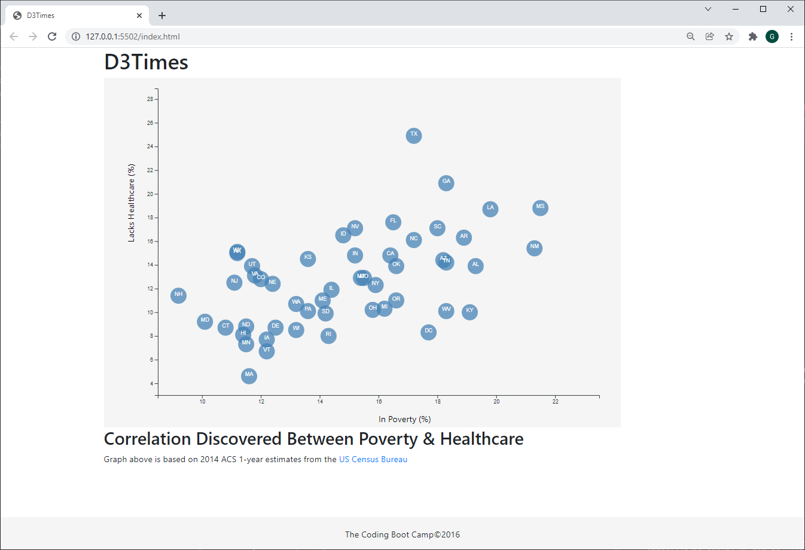

# D3-challenge
## D3 Homework - Data Journalism and D3 ##

This assignment builds a D3 scatter plot (with state abbreviation labels) representing the correlation between those in poverty (%) and lacking healtcare (%).

* * NOTE: The Bonus portion was NOT attempted * *

